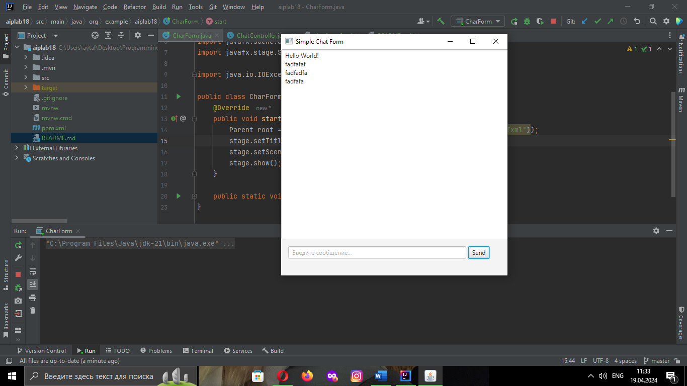

# Отчет по лабораторной работе "Форма для чата на JavaFX"

## Общее описание
Лабораторная работа направлена на создание простой формы для чата с использованием JavaFX. Форма позволяет пользователю вводить сообщения в текстовое поле и отправлять их при нажатии кнопки "Send". Отправленные сообщения отображаются в области чата.

## Структура проекта
Проект содержит три основных компонента:

### Main (CharForm.java):
- Класс `CharForm` является основным классом приложения, который наследуется от `Application` из JavaFX.
- Метод `start(Stage stage)` инициализирует графический интерфейс, загружая корневой элемент из файла FXML.
- Заголовок окна устанавливается как "Simple Chat Form".
- Создается сцена, на которой отображается корневой элемент интерфейса, заданный размером 450x450 пикселей.

### Controller (ChatController.java):
- Класс `ChatController` является контроллером, который управляет взаимодействием с элементами интерфейса из файла FXML.
- Метод `sendMsg()` вызывается при нажатии кнопки "Send".
    - Он извлекает текст из текстового поля `MessageInp`.
    - Если сообщение не пустое, оно добавляется в область чата (`Display`) и текстовое поле очищается.

### chatform.fxml:
- Этот файл содержит разметку интерфейса с использованием языка разметки FXML.
- Он содержит компоненты управления: `TextArea` для отображения чата, `TextField` для ввода сообщений и `Button` для отправки сообщений.
- Каждый компонент управления имеет свой идентификатор (`fx:id`), который используется для связи с контроллером.
- Метод `sendMsg` контроллера связывается с событием нажатия кнопки "Send" для отправки сообщений.

## Работа приложения
Пользователь вводит сообщение в текстовое поле "Введите сообщение..." и нажимает кнопку "Send". Введенное сообщение отображается в области чата. При этом текстовое поле очищается, готовое для ввода нового сообщения.

